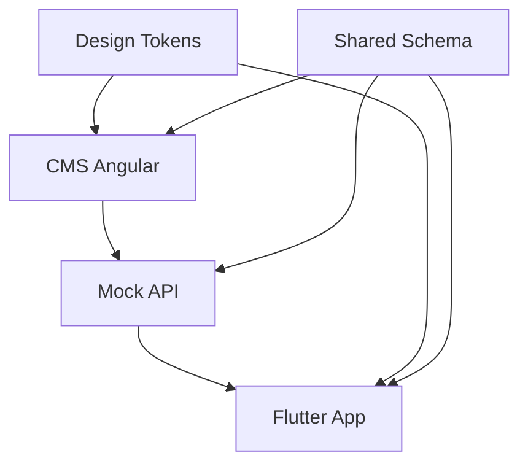

# POC Server Driven UI

POC didatica para demonstrar como um CMS em Angular pode montar uma tela via JSON e como um app Flutter pode renderizar essa mesma tela usando contratos e design tokens compartilhados.

O objetivo nao e criar uma arquitetura perfeita de producao. O objetivo e provar o racional tecnico com pouco atrito: o CMS altera o payload, a API valida, e o Flutter renderiza widgets nativos a partir do mesmo contrato.

## Conceito

Server Driven UI e uma abordagem em que o servidor entrega uma descricao da tela, geralmente em JSON. O cliente interpreta esse payload e decide quais componentes nativos renderizar.

Nesta POC, o payload descreve blocos como `hero`, `text`, `card`, `video` e `button`. O Angular usa componentes Angular para preview. O Flutter usa widgets Flutter. Eles nao compartilham UI, apenas o contrato.

Para aproximar de um desenho de producao, `packages/shared-schema` tambem contem `src/block-catalog.ts`, um catalogo com labels, campos editaveis e defaults. O CMS usa esse catalogo para montar formularios de blocos sem hardcodar cada campo na tela.

## Arquitetura

```text
poc-server-driven-ui/
  README.md
  apps/
    cms-angular/
    mock-api/
    flutter-app/
  packages/
    design-tokens/
    shared-schema/
```



## O Que E Compartilhado

- Design tokens: cores, espacamentos, radius e tipografia.
- Schemas e contratos.
- Nomes de blocos: `hero`, `text`, `button`, `card`.
- Variantes: por exemplo, `button.variant = primary | secondary`.
- Estrutura do payload.

## O Que Nao E Compartilhado

- Componentes visuais.
- HTML/CSS do CMS.
- Widgets Flutter.
- Logica visual especifica de cada plataforma.

## Por Que Nao Compartilhar UI Entre Angular E Flutter

Angular e Flutter renderizam em modelos diferentes. O Angular trabalha com DOM e CSS; Flutter trabalha com widgets e canvas nativo da propria engine.

Compartilhar componentes visuais diretamente entre as duas plataformas criaria acoplamento forte, reduziria a qualidade nativa e dificultaria a evolucao independente. O contrato compartilhado e suficiente para alinhar semantica e comportamento esperado, enquanto cada plataforma preserva sua implementacao visual.

## Payload Exemplo

```json
{
  "screen": "home",
  "version": "1.0.0",
  "blocks": [
    {
      "type": "hero",
      "props": {
        "title": "Bem-vindo ao App",
        "subtitle": "Essa tela veio do CMS"
      }
    },
    {
      "type": "text",
      "props": {
        "content": "Esse é um exemplo de conteúdo dinâmico."
      }
    },
    {
      "type": "card",
      "props": {
        "title": "Design System",
        "description": "Angular e Flutter usam o mesmo contrato."
      }
    },
    {
      "type": "button",
      "props": {
        "label": "Começar",
        "variant": "primary",
        "action": {
          "type": "navigate",
          "target": "/home"
        }
      }
    }
  ]
}
```

## Como Rodar

Instale as dependencias do monorepo:

```bash
pnpm install
```

Rode a Mock API:

```bash
pnpm dev:api
```

Rode o CMS Angular:

```bash
pnpm dev:cms
```

Abra o CMS em:

```text
http://localhost:4200
```

Rode o Flutter:

```bash
cd apps/flutter-app
flutter pub get
flutter run
```

No Android emulator, a URL da API deve ser `http://10.0.2.2:3333/screen/home`. No iOS simulator, use `http://localhost:3333/screen/home`. Isso esta documentado em `apps/flutter-app/README.md`.

## Fluxo Da Demo

1. Rode `pnpm dev:api`.
2. Rode `pnpm dev:cms`.
3. Rode o app Flutter.
4. Edite os blocos no CMS.
5. Altere o titulo do `hero`.
6. Troque a ordem dos blocos no array `blocks`.
7. Mude o `variant` do botao de `primary` para `secondary`.
8. Clique em `Validar tela`.
9. Clique em `Publicar`.
10. Recarregue o Flutter e veja a tela refletir a mudanca.

## Criterios De Sucesso

- CMS altera titulo e Flutter reflete.
- CMS altera ordem dos blocos e Flutter reflete.
- CMS altera `variant` do botao e Flutter reflete.
- API bloqueia payload invalido.
- Flutter nao quebra com bloco desconhecido.
- Angular e Flutter tem implementacoes proprias, mas seguem o mesmo contrato.

## Limitacoes

- Esta POC nao e uma solucao final de producao.
- Nao cobre autenticacao.
- Nao cobre versionamento avancado de schema.
- Nao cobre feature flags.
- Nao cobre cache/offline.
- Nao cobre analytics.
- Nao cobre permissoes do CMS.
- Nao cobre publicacao real em um headless CMS.
- O armazenamento da Mock API e apenas em memoria.
- Os tokens sao mantidos manualmente para fins didaticos.

## Proximos Passos

- Adicionar versionamento de schema.
- Adicionar feature flags.
- Adicionar cache no Flutter.
- Adicionar preview por plataforma.
- Adicionar Storybook.
- Adicionar testes unitarios nos renderers.
- Adicionar CI validando schemas e tokens.
- Avaliar geracao de models Dart via JSON Schema/OpenAPI quando a POC evoluir para producao.
- Avaliar Style Dictionary para gerar tokens automaticamente.
- Avaliar integracao com headless CMS real.
